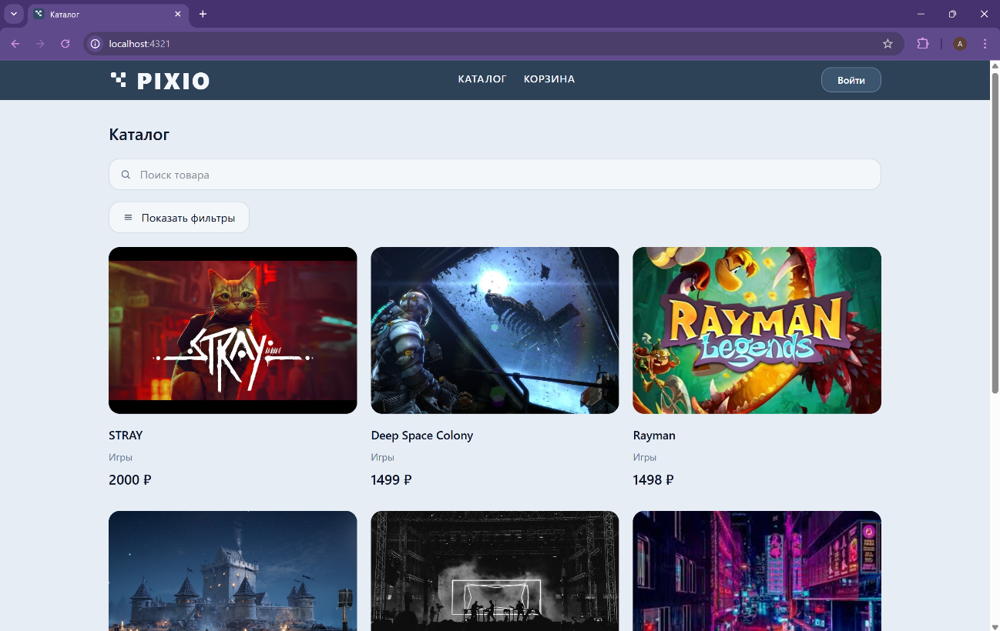
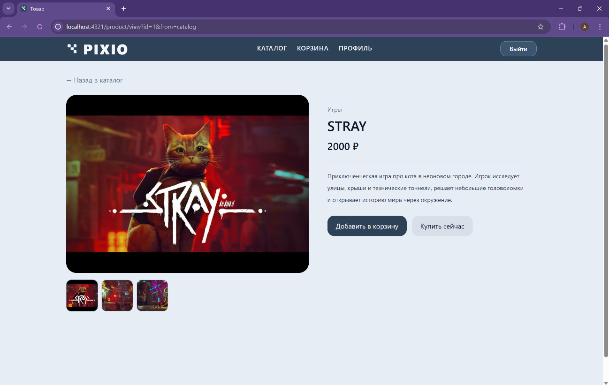
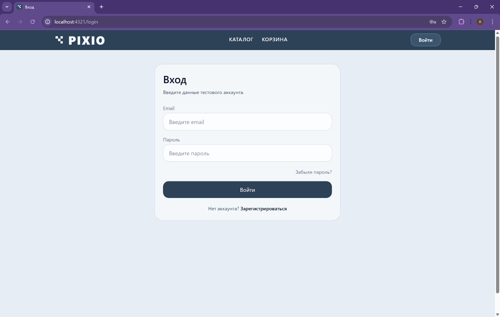
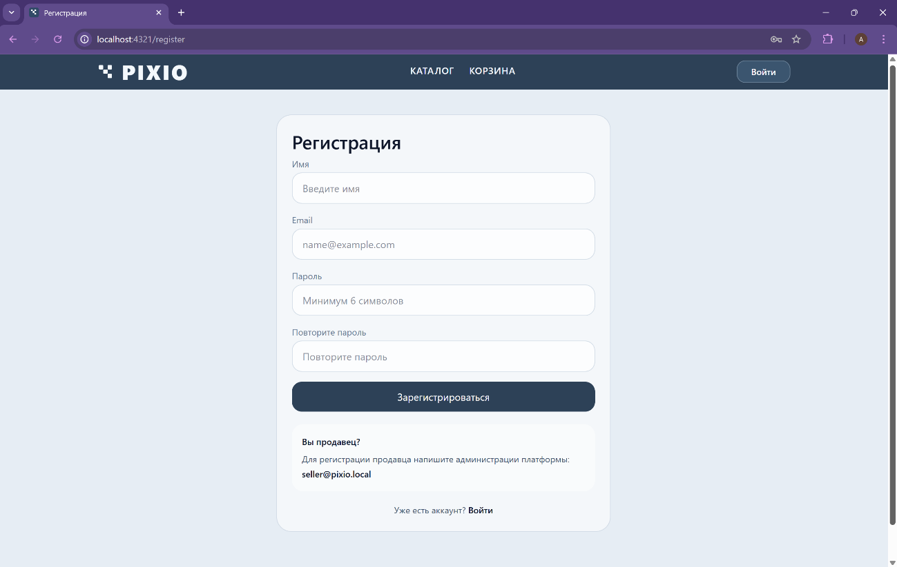
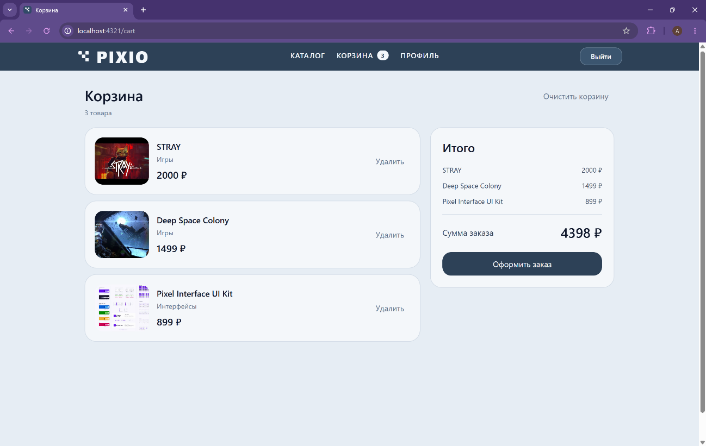
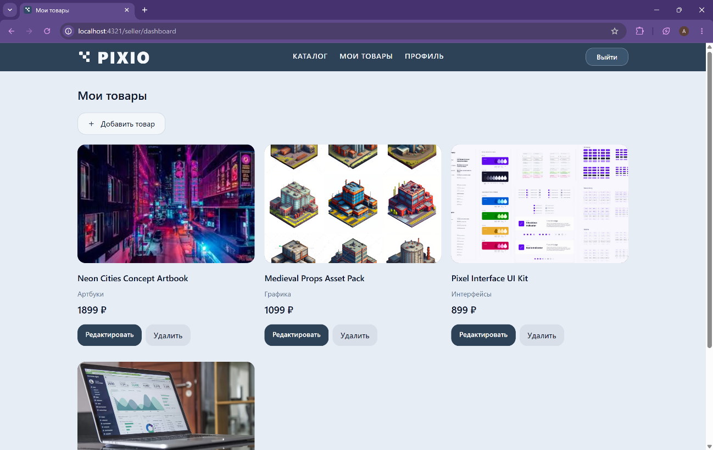
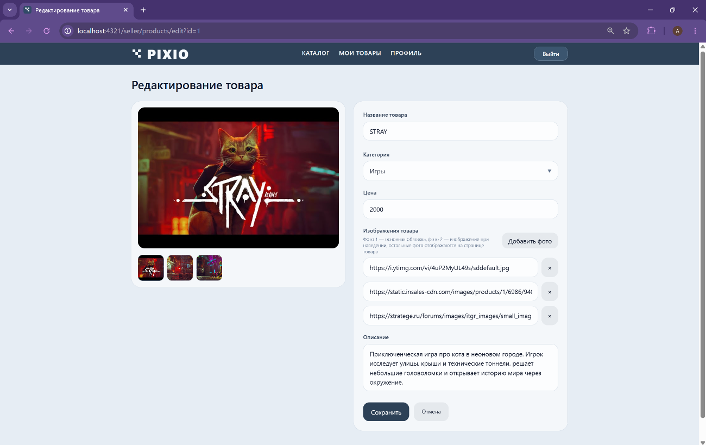

# Pixio — Digital Products Marketplace

Pixio — дипломный web-проект, разработанный в рамках выпускной квалификационной работы в МГТУ им. Н. Э. Баумана по направлению «Системы автоматизированного проектирования». Дипломный проект успешно защищён.

Проект представляет собой marketplace для продажи цифровых продуктов. В приложении реализованы каталог товаров, регистрация и авторизация пользователей, роли покупателя и продавца, корзина, оформление заказов и управление товарами со стороны продавца.

Приложение построено по клиент-серверной архитектуре с отдельной frontend- и backend-частью. Backend отвечает за обработку HTTP-запросов, работу с базой данных, авторизацию пользователей, разграничение ролей и реализацию основной бизнес-логики.

## Стек технологий

### Backend

* C++
* Drogon
* PostgreSQL
* REST API
* JSON
* CMake

### Frontend

* Astro
* Svelte
* Tailwind CSS
* JavaScript / TypeScript

### Инструменты

* Git / GitHub
* Linux / Ubuntu
* PostgreSQL
* Postman / API testing

## Архитектура проекта

Проект построен по клиент-серверной архитектуре:

```text
Frontend → REST API → Backend → PostgreSQL
```

Frontend отвечает за пользовательский интерфейс и отправку запросов к API. Backend обрабатывает бизнес-логику, взаимодействует с PostgreSQL и возвращает данные клиентской части.

## Структура проекта

```text
pixio-digital-marketplace/
├── backend/        # серверная часть на C++ / Drogon
├── frontend/       # клиентская часть на Astro / Svelte / Tailwind CSS
├── database/       # структура базы данных и демонстрационные данные
├── README.md       # описание проекта
└── .gitignore
```

## Основной функционал

### Для покупателя

* регистрация и авторизация;
* просмотр каталога цифровых продуктов;
* просмотр страницы товара;
* добавление товара в корзину;
* оформление заказа;
* просмотр купленных товаров;
* получение демонстрационного лицензионного ключа после покупки.

### Для продавца

* авторизация в системе;
* просмотр собственных товаров;
* добавление нового товара;
* редактирование карточки товара;
* удаление товара;
* просмотр заказов по своим товарам.

### Серверная часть

* обработка HTTP-запросов;
* REST API для работы с пользователями, товарами, корзиной и заказами;
* взаимодействие с PostgreSQL;
* разграничение ролей пользователей;
* обработка ошибок и базовая валидация данных.

## База данных

В проекте используется PostgreSQL. Структура базы данных находится в папке `database`.

Основные файлы:

* `database/schema.sql` — структура базы данных;
* `database/seed.sql` — демонстрационные данные для локального запуска;
* `database/README.md` — описание работы с базой данных.

## Запуск проекта

### Backend

```bash
cd backend
mkdir -p build
cmake -S . -B build
cmake --build build -j2
./build/pixio_backend
```

Если имя исполняемого файла отличается, его можно посмотреть командой:

```bash
find build -maxdepth 2 -type f -executable -print
```

### Frontend

```bash
cd frontend
npm install
npm run dev
```

### База данных

```bash
createdb pixio_db
psql -U postgres -d pixio_db -f database/schema.sql
psql -U postgres -d pixio_db -f database/seed.sql
```

Если используется отдельный пользователь базы данных, например `pixio_user`, команды восстановления нужно выполнить от пользователя, у которого есть права на создание таблиц.

## Скриншоты

### Каталог товаров



### Страница товара



### Авторизация



### Регистрация



### Корзина



### Оформление заказа


### Успешное оформление заказа


### Профиль покупателя


### Кабинет продавца



### Добавление или редактирование товара



## Статус проекта

Проект разработан и успешно защищён в рамках выпускной квалификационной работы.

Основная цель проекта заключалась в разработке клиент-серверного web-приложения для цифровой дистрибуции продуктов с реализацией backend-части, REST API, работы с базой данных, авторизации пользователей, разграничения ролей и бизнес-логики marketplace.

Проект демонстрирует навыки разработки серверной логики, проектирования структуры базы данных, организации взаимодействия frontend- и backend-частей, а также практическое применение технологий web-разработки.

## Что планируется улучшить

* добавить Docker Compose для запуска всего проекта одной командой;
* расширить покрытие backend-тестами;
* добавить OpenAPI/Swagger-документацию;
* улучшить обработку ошибок;
* добавить CI-проверку сборки проекта.
